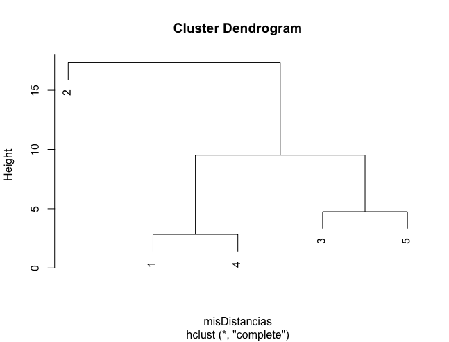
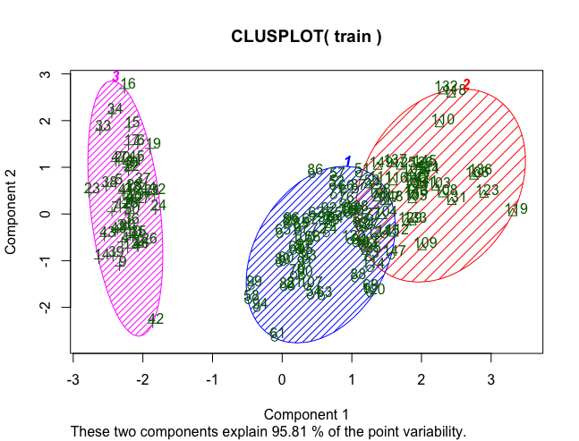
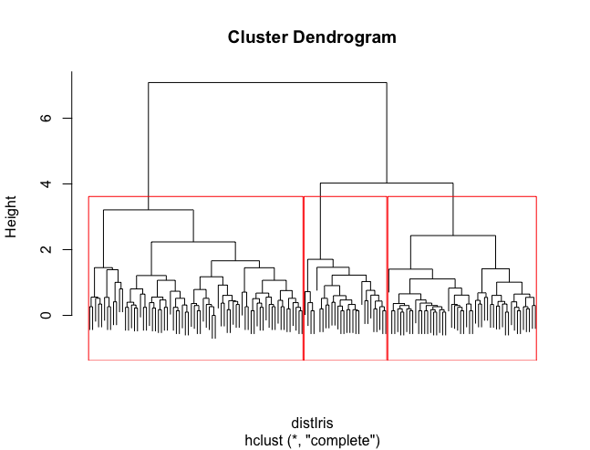
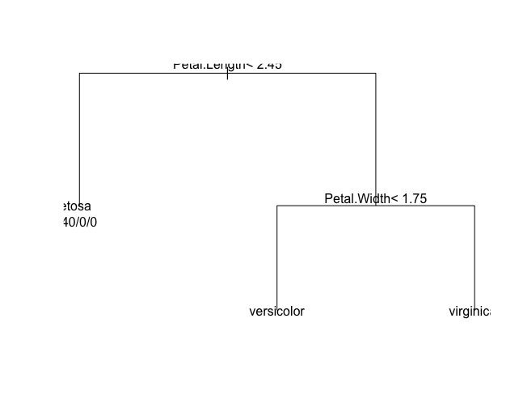

# R-Machine-Learning
Pequeño manual personal para hacer Machine Learning en R.

Una de las claves del machine learning es disponer de unos buenos datos que ayuden a nuestro algoritmo a aprender. Para ello, existen numerosas técnicas que nos permite mejorar nuestro conjunto de entrenamiento realizando un pre-procesamiento previo.

Algoritmos de Machine Learning:
* Clustering: Para realizar agrupamientos de datos.
* Clasificación: Para predecir el valor de una variable categórica.
* Regresión: Para predecir el valor de una variable continua.

https://www.kaggle.com/

## Missing Values o Valores Faltantes
Un valor faltante en R se define como aquel del cual sabemos su tipo pero no su valor. Estos valores, se representan como *NA*. El problema de estos valores es que nos impiden poder realizar analítica sobre ellos. La idea es no tenerlos en consideración. Veamos un ejemplo.

```r
datos = women
datos$height[1] = NA
datos

mean(datos$height)
# No podriamos calcular la media debido a un valor faltante

# Con la funcion na.rm podemos eliminar los valores faltantes.
mean(datos$height, na.rm = TRUE)

# Con la función complete.cases tenemos un array de los casos que no tiene NA.
complete.cases(datos)

# Lo podemos usar para filtrar
datosCompletos = datos[complete.cases(datos),]
# O podemos usar la función na.omit
datosCompletos1 = na.omit(datos)
```

## Special values o Valores especiales
Algunos conjuntos de datos también pueden llevar valores especiales, considerando un valor especial todo aquel que no esté en el conjunto de los reales (ℝ), como son el Inf o -Inf. Del mismo modo que antes, estos valores nos condicionan completamente cualquier estadística que intentemos calcular, por lo que debemos evitarlos. Para ello vamos a usar la función *is.finite(x)* o *is.infinite*

```r
datos = trees
datos
datos$Volume[5] = Inf

# A la hora de realizar una estadistica, el valor infinito nos condiciona.
mean(datos$Volume)
max(datos$Volume)

is.finite(datos$Volume)

# Podemos volver a filtrar del mismo modo que antes
datFinitos = datos[is.finite(datos$Volume),]
datFinitos
max(datFinitos$Volume)
mean(datFinitos$Volume)

# Tambien esta la accion is.infinite()
is.infinite(datos$Volume)
```

## Outliers o valores extraños
Otro tema a tener en cuenta en el pre-procesamiento de los datos es los outliers o valores extraños. Un outliers se define como un valor o conjunto de valores que son inconsistentes respecto al resto de valores. Estos valores pueden interpretarse como valores erróneos que no debemos tener en cuenta. En este caso usaremos la función *boxplot.stats(x)*

```r
datos = trees
datos$Volume[1] = 300
datos$Volume[2] = 315

boxplot.stats(datos$Volume)

# Con un diagrama de cajas también podemos observarlo
boxplot(datos$Volume)

# Vemos como la altura no tiene outliers
boxplot(datos$Volume, datos$Height)
```


## Clustering

El clustering es una técnica de aprendizaje *no supervisado* que consiste en la agrupación de los datos en clusters o bloques con características similares.
Cuando iniciamos una investigación es deseable tener cierta idea de la estructura de los datos. Para ello, podemos comenzar aplicando técnicas de clustering a nuestros datos, para luego continuar con nuevas técnicas.
Para este ejemplo vamos a utilizar un pequeño conjunto de datos que tiene datos relativos a 3 variables de 4 tipos de genes.

```r
miTabla = read.csv("genesDataSet.txt", sep="\t", row.names="gen")
miTabla

# Calculamos las distancias entre los puntos
help(dist)
# Usamos como distancia la distancia euclidea.
misDistancias=dist(miTabla,method="euclidean")
misDistancias

# Con la función hclust podemos crear un arbol en el que podemos hacernos una idea del
# posible clustering
help("hclust")
arbolJerarquico = hclust(misDistancias, method="complete")
plot(arbolJerarquico) #dibuja en una ventana

# Tambien podemos pintar los puntos en un gráfico para observarlos previamente.

miTabla
trans = t(miTabla)
trans
plot(trans[,1], col = "red", ylim = c(min(miTabla),max(miTabla)), pch = 2)
points(trans[,2], col = "green", pch = 3)
points(trans[,3], col = "blue", pch = 4)
points(trans[,4], col = "brown", pch = 5)
```



## Kmeans

Entre los algoritmos más usado en las técnicas de cluster se encuentra el *KMeans*, el cual divide los datos en n grupos. /Podéis ver su funcionamiento en las transparencias/ . Veamos como funciona kmeans en R.

```r
help("kmeans")
kme2 = kmeans(miTabla, 2)
kme2

kme3 = kmeans(miTabla, 3)
kme3

# Pintamos los clusters obtenidos
library(cluster) 
clusplot(miTabla, kme2$cluster, color = TRUE, shade = TRUE, labels = 2, lines = 0)
```

Trabajamos ahora con un conjunto de datos muy conocido como *iris*. (Necesitamos instalar el package de ‘cluster’).

```r
iris
# Eliminamos la variable categórica
train = iris[, -5]
y = iris$Species
train

# Entrenamos el modelo
fit = kmeans(train, 3)
fit

# Pintamos los clusters obtenidos
clusplot(train, fit$cluster, color = TRUE, shade = TRUE, labels = 2, lines = 0)

#Comparamos resultados
table(y, fit$cluster)
```



Es difícil, a la hora de aplicar clustering, saber el número de clusters qué estamos buscando. Para ello, existen algunos métodos que intentan ayudarnos, pero no hay nada fijo. Nosotros, podemos usar la variable withinss resultante de aplicar el modelo.

```r
Error = NULL
for(i in 1:maxClust) {
  Error[i] = sum(kmeans(train, i)$withinss)
}
Error
plot(1:maxClust, Error, type="b", 
     xlab="Cantidad de Cluster", 
     ylab="Suma de error")
```

## Agrupación Jerárquica
También podemos realizar la agrupación mediante la creación de un árbol. Para ello vamos a usar la función *cutree* para dividir, o la función *rect.hclust* para dibujar la división.

```r
#######
####### Agrupación jerárquica.
#######

# De nuevo, podemos volver a pintar el arbol
distIris = dist(train, method = "euclidean")
distIris
arbolIris = hclust(distIris, method = "complete")
plot(arbolIris, labels = FALSE)

# También podemos usar la función cutree para conseguir la clusterización.

grupos = cutree(arbolIris, k = 3)
grupos
plot(arbolIris, labels = FALSE)
# La pintamos
rect.hclust(arbolIris, k = 3)
```




Para comprobar resultados, volvemos a crear una tabla.

```r
# Comprobación
table(grupos, iris[,5])
```

## Ejercicios
### Ejercicio 1

Analiza el conjunto de datos /airquality/. Luego, calcula la temperatura media del conjunto de datos para el mes 7. Realiza el pre-procesamiento que creas conveniente.

```r
str(airquality)

# Comprobamos valores especiales
which(is.infinite(airquality$Ozone) == TRUE)
which(is.infinite(airquality$Solar.R) == TRUE)
which(is.infinite(airquality$Wind) == TRUE)
which(is.infinite(airquality$Temp) == TRUE)
which(is.infinite(airquality$Month) == TRUE)
which(is.infinite(airquality$Day) == TRUE)

# Comprobamos valores faltantes
complete.cases(airquality)
# Nos quedamos solo con los casos completos
datos = airquality[complete.cases(airquality), ]
datos

mediaTemp = mean(datos$Temp)
mediaTemp
```

### Ejercicio 2

La librería ::rpart:: contiene nuevos datasets. Importa dicha librería y estudia el conjunto de datos *car90*. Realiza el pre-procesamiento que creas conveniente.

```r
library(rpart)
help(car90)

# Country --> Pais
# Disp --> Desplazamiento del motor en pulgadas cubicas
# Disp2 --> Cilindrada
# Eng.Rev --> Revoluciones del motor
# Front.Hd --> Distancia entre techo y pasajero
# Frt.Leg.Room --> Espacio para las piernas
# Frt.Shld --> Espacio para hombros
# ...
# ...
# Height --> Altura
# Length --> Tamaño
# ...
# ...

head(car90)

# Vemos cuantos casos completos tenemos
length(which(complete.cases(car90) == TRUE))
length(car90[,1])

# Son demasiado pocos, nuetro conjunto quedaria demasiado reducido. Vamos por variables concretas
length(which(complete.cases(car90$Eng.Rev) == TRUE))
length(car90[,1])

filtrado = car90[complete.cases(car90$Eng.Rev), ]
filtrado

# Podemos eliminar variables que no creamos convenientes
filtrado = filtrado[, -15]
filtrado

# Buscamos valores especiales
# El espacio no puede ser negativo.
filtrado$Luggage >= 0
filtrado = filtrado[filtrado$Luggage > 0, ]

# Podemos buscar si existe algun outlier.
boxplot(filtrado)

boxplot(filtrado$Price)

boxplot.stats(filtrado$Price)
filtrado$Price

mean(filtrado$Price)

# Podemos eliminar el caso que posee el outlier
filtrado = filtrado[filtrado$Price < 41990, ]
mean(filtrado$Price)
```

### Ejercicio 3

Usando el conjunto de datos /attitude/.
* Comprende dicho conjunto de datos.
* Realiza, si es necesario, un pre-procesamiento.
* Realiza un gráfico de puntos que compare la variable /learning/ (eje x) respecto a /raises/ (eje y).
* Utiliza el algoritmo de Kmeans para aplicar técnicas de clustering sobre representación anterior para 1, 2, 3 y 4 clusters. ¿Cuál tienen mejores resultados?

```r
library(datasets)
str(attitude)
help("attitude")

# Vamos a comparar las oportunidades de aprender con los aumentos por rendimiento.
plot(attitude$raises ~ attitude$learning)

datos = attitude[, c(4,5)]
datos
# Los datos están 'limpios', por lo que aplicamos el algoritmo de Kmeans para 2 clusters
model = kmeans(datos, 2)
model

# Pintamos los clusters obtenidos
library(cluster) 
clusplot(datos, model$cluster, color = TRUE, shade = TRUE, labels = 2, lines = 0)


# Para 3 cluster
model3 = kmeans(datos, 3)
clusplot(datos, model3$cluster, color = TRUE, shade = TRUE, labels = 2, lines = 0)

# Para 4 cluster
model4 = kmeans(datos, 4)
clusplot(datos, model4$cluster, color = TRUE, shade = TRUE, labels = 2, lines = 0)


Error = NULL
for(i in 2:4) {
  print(i)
  Error[i] = sum(kmeans(datos, i)$withinss)
}
na.omit(Error)
plot(2:4, na.omit(Error), type="b", 
     xlab="Cantidad de Cluster", 
     ylab="Suma de error")
```

### Ejercicio 4

Usando el mismo conjunto de datos del Ejercicio 3, aplica la técnica de agrupación jerárquica para realizar la clusterización de los datos. De nuevo, utilizar las variables /learning/ (eje x) respecto a /raises/. Por último, repetir los pasos utilizando todas las variables. ¿Obtenemos la misma clusterización?

```r
datos = attitude[, c(4,5)]
datos

distancia = dist(datos, method = "euclidean")
model = hclust(distancia, method = "complete")
model

# Dibujamos el dendograma
plot(model, labels = FALSE)

# Buscamos la clusterizacion con 2
grupos = cutree(model, k = 2)
grupos

plot(model, labels = FALSE)
rect.hclust(model, k = 2)

# k = 3
# Buscamos la clusterizacion con 3
grupos3 = cutree(model, k = 3)
grupos3

plot(model, labels = FALSE)
rect.hclust(model, k = 3)

# Realizamos la clusterización usando todas las variables.
distanciaTodos = dist(attitude, method = "euclidean")
modelTodos = hclust(distanciaTodos, method = "complete")
plot(modelTodos, labels = FALSE)

# k = 2
plot(modelTodos, labels = FALSE)
rect.hclust(model, k = 2)

# k = 3
plot(modelTodos, labels = FALSE)
rect.hclust(model, k = 3)
```

## Técnicas de Clasificación
En Machine Learning, un problema de clasificación intenta predecir el valor de una variable *categórica*. De nuevo, tendremos un conjunto de entrenamiento y un conjunto de test con el cual validar nuestro modelo.

## Árboles de Decisión
Una técnica muy usual en los problemas de clasificación son los árboles de decisión. Esta técnica consiste en crear un árbol con los datos que tenemos del conjunto de entrenamiento, y luego validar este modelo con los datos de test.

```r
help("sample")

# Inicializamos la semilla
set.seed(1234)
# Creamos un vector del tamaño del conjunto de datos con 1 y 0.
ind <- sample(2, nrow(iris), replace = TRUE, prob = c(0.7, 0.3))
ind

train = iris[ind == 1,]
test = iris[ind == 2, ]
nrow(train)
nrow(test)
```

* Librería rpart

```r
library(rpart)

formula = Species ~ Sepal.Length + Sepal.Width + Petal.Length + Petal.Width
arbol = rpart(formula = formula, data = train)
print(arbol)

# Dibujamos el arbol
plot(arbol)
text(arbol, use.n = TRUE)

# Comprobamos los resultados
testPred = predict(arbol, newdata = test, type = "class")
testPred
table(testPred, test$Species)
```



## Random Forest
Otra técnica en clasificación es el random forest, el cual consiste en crear /n/ arboles de decisión con /n/ conjuntos distintos de entrenamiento (ocurre internamente). Luego, la predicción será aquella dada por la mayoría de los árboles.

```r
library(randomForest)
randomForest <- randomForest(Species ~ ., data=train, ntree=50,
                   proximity=T)
rf

# Podemos dibujar los arboles con su error
plot(rf)

# Con la siguiente función comprobamos las variables mas importantes
importance(rf)
varImpPlot(rf)

pred = predict(rf, newdata = test)
pred
table(pred, test$Species)
```

*GRAFICO6*
*GRAFICO7*

## J48
Para comenzar, debemos instalarnos la librería de *RWeka* . 
Ahora, podemos importar y probar el algoritmo.

```r
library(RWeka)
model = J48(Species ~ Sepal.Length + Sepal.Width + Petal.Length, data = train)
model

library(partykit)
plot(model, labels = TRUE)
predJ48 = predict(model, newdata = test)
table(predJ48, test$Species)
```

*GRAFICO8*

## Técnicas de Regresión
Cuando nos enfrentamos a un problema de regresión, nos enfrentamos al problema de predecir una variable cuyo valor es continuo. Por ello, este problema suele ser más complicado que un problema de clasificación.

## Linear Regression
Para la regresión, también podemos usar el algoritmo /linear regression/. En este caso, sé calculará una recta *y = ax + b* , de manera que podamos predecir el valor de y. Este algoritmo está pensado para la predicción de 2 variables que son dependientes y n independientes.

```r
Orange
plot(Orange$circumference ~ Orange$age)

set.seed(1234)
# Creamos un vector del tamaño del conjunto de datos con 1 y 0.
ind <- sample(2, nrow(Orange), replace = TRUE, prob = c(0.7, 0.3))
ind

train = Orange[ind == 1,]
test = Orange[ind == 2, ]
nrow(train)
nrow(test)

linearMod = lm(circumference ~ age, data = train)
print(linearMod)
summary(linearMod)

distPred <- predict(linearMod, test)
distPred
test
```

*GRAFICO9*

## M5
El algoritmo M5 crea un árbol de decisión, donde sus hojas son modelos lineales.

```r
library(rJava)
library(RWeka)
library(partykit)

m5model = M5P(circumference ~ age, data = train)
print(m5model)
plot(m5model)
predM5 = predict(m5model, newdata = test)
predM5
test


# Probamos con el conjunto de datos airquality

set.seed(4321)
datos = na.omit(airquality)

indAir <- sample(2, nrow(datos), replace = TRUE, prob = c(0.8, 0.2))

trainAir = datos[indAir == 1,]
testAir = datos[indAir == 2, ]

nrow(trainAir)
nrow(testAir)

m5modelAir = M5P(Temp ~ Solar.R + Wind + Ozone , data = trainAir)
print(m5modelAir)
plot(m5modelAir)

predM5Air = predict(m5modelAir, newdata = testAir)
predM5Air
testAir$Temp
```
Ejercicios: Clasificación y Regresión
### Ejercicio1 

Haciendo uso del conjunto de datos /car90/.
1. Filtra los datos para quedarnos únicamente con las variables *Front.Hd*, *Frt.Leg.Room*, *Frt.Shld*, *Rear.Hd*, *RearShld* y *Type*.
2. Realiza un breve pre-procesamiento para eliminar los casos no completos.
3. Crea un árbol de decisión para predecir la variable *Type* según los valores del resto de variables.
4. Pinta el árbol de decisión creado.
5. ¿Qué resultados obtenemos? ¿Es un buen modelo? ¿Puede mejorar con otras variables?

```r
car90

library(rpart)

# Front.Hd
# Frt.Leg.Room
# Frt.Shld
# Rear.Hd
# RearShld

# Type
variables = list("Front.Hd", "Frt.Leg.Room", "Frt.Shld", "Rear.Hd", "RearShld", "Type")
datos = car90[, which((names(car90) %in% variables)==TRUE)]
datos
nrow(datos)
datos = datos[complete.cases(datos) == TRUE, ]
nrow(datos)

# Elegimos el conjunto de entrenamiento
ind <- sample(2, nrow(datos), replace = TRUE, prob = c(0.8, 0.2))
ind

train = datos[ind == 1,]
test = datos[ind == 2, ]
nrow(train)
nrow(test)

## Creamos el arbol de decision.
formula = Type ~ Front.Hd + Frt.Leg.Room + Frt.Shld + Rear.Hd + RearShld
arbol = rpart(formula = formula, data = train)

plot(arbol)
text(arbol, use.n = TRUE)


testPred = predict(arbol, newdata = test, type = "class")
testPred
tabla = table(testPred, test$Type)
tabla

# Comprobamos %
diag(tabla) # Casos acertados
nrow(test) # Numero de casos
sum(diag(tabla)) / nrow(test)
```

*GRAFICO10*
*GRAFICO11*

### Ejercicio2
 
Haciendo uso del dataset *stagec*:
1. Estudia los datos.
2. Realiza un breve pre-procesamiento de los datos para eliminar duplicados y crear una nueva variable /nivel/, de tipo factor con los valores de la variable /grade/.
3. Intenta predecir el valor de la variable /nivel/ en función de otras variables usando el método de *random forest*. Realiza varias pruebas con distintas variables involucradas en la fórmula.
4. ¿Qué porcentaje de acierto obtenemos?

```r
library(randomForest)
help("stagec")

datos = stagec

nrow(datos)
nrow(na.omit(datos))

datos = na.omit(datos)

nivel = factor(datos$grade)
nivel

datos$nivel = nivel

# Elegimos el conjunto de entrenamiento
ind <- sample(2, nrow(datos), replace = TRUE, prob = c(0.8, 0.2))
ind

train = datos[ind == 1,]
test = datos[ind == 2, ]
nrow(train)
nrow(test)

# Creamos el modelo
formula = nivel ~ g2 + ploidy + eet 
# formula = nivel ~ g2 + ploidy + eet + gleason
model = randomForest(formula, data = train, ntree = 100, proximity=T)

plot(model)

# Con la siguiente funci?n comprobamos las variables mas importantes
importance(model)
varImpPlot(model)


# Comprobamos con conjunto de test
pred = predict(model, newdata = test)
pred
tabla = table(pred, test$nivel)
tabla
aciertos = sum(diag(tabla)) / nrow(test)
aciertos

# Podemos mejorar añadiendo la variable gleason a la formula.
```

*GRAFICO12*
*GRAFICO13*

### Ejercicio 3

Usando el mismo conjunto de datos anterior, realiza la predicción usando ahora el algoritmo J48 de la librería RWeka y compara los resultados con los del ejercicio 2.

```r
library(RWeka)
datos = na.omit(stagec)

nivel = factor(datos$grade)
datos$nivel = nivel

# Elegimos el conjunto de entrenamiento
ind <- sample(2, nrow(datos), replace = TRUE, prob = c(0.8, 0.2))
ind

train = datos[ind == 1,]
test = datos[ind == 2, ]

modelWeka = J48(formula = nivel ~ g2 + ploidy + eet, data = train)
modelWeka


library(partykit)
plot(modelWeka, labels = TRUE)

predJ48 = predict(modelWeka, newdata = test)

tabla = table(predJ48, test$nivel)
tabla
aciertos = sum(diag(tabla)) / nrow(test)
aciertos
```

### Ejercicio 4

Usando el conjunto de datos *women*, aplica el método de /linear regression/ para predecir los valores de la variable /height/. Dibuja previamente los datos y justifica si este método puede dar buenos resultados o no.

```r
str(women)

plot(women$height ~ women$weight)

set.seed(1234)
# Creamos un vector del tamaño del conjunto de datos con 1 y 0.
ind <- sample(2, nrow(women), replace = TRUE, prob = c(0.7, 0.3))
ind

train = women[ind == 1,]
test = women[ind == 2, ]
nrow(train)
nrow(test)

linearMod = lm(height ~ weight, data = train)
print(linearMod)

plot(linearMod)
summary(linearMod)

distPred <- predict(linearMod, test)
distPred
test
```

*GRAFICO14*
*GRAFICO15*
*GRAFICO16*
*GRAFICO17*
*GRAFICO18*

### Ejercicio 5

Haciendo uso del dataset *ChickWeight*, utiliza el algoritmo M5P de la librería RWeka para predecir el valor de la variable /Time/. Usa las variables que consideres convenientes.

```r
library(RWeka)
help(ChickWeight)
head(ChickWeight)

ind <- sample(2, nrow(ChickWeight), replace = TRUE, prob = c(0.7, 0.3))

trainChick = ChickWeight[ind == 1,]
testChick = ChickWeight[ind == 2, ]

nrow(trainChick)
nrow(testChick)

# Aplicamos algoritmo
m5model = M5P(Time ~ weight + Chick + Diet , data = trainChick)
print(m5model)
plot(m5model)

predM5 = predict(m5model, newdata = testChick)
predM5
testChick$Time

# Calculamos error
error = abs(predM5 - testChick$Time)
error
sqrt(sum(error^2))
```

